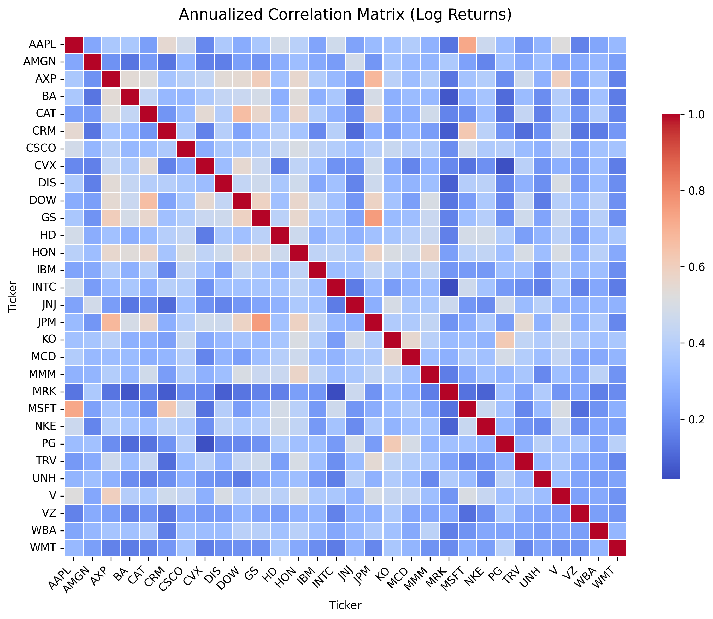
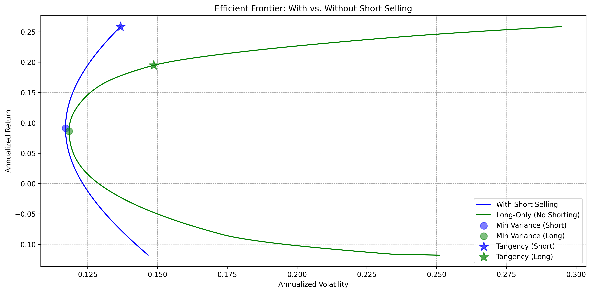
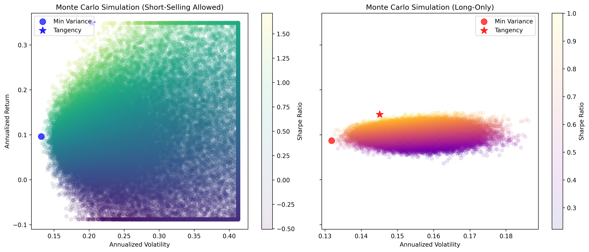

# Portfolio Optimization

This repository contains a comprehensive portfolio optimization project completed during my Master's in Quantitative Finance at USI Lugano. It blends Modern Portfolio Theory with real-world data and simulation techniques to evaluate and visualize optimal asset allocation strategies.

## Overview

The project explores key concepts and techniques in portfolio construction:

- Analytical efficient frontier computation with and without short-selling  
- Monte Carlo simulations to approximate the efficient frontier and test diversification  
- Weight generation using truncated normal and Dirichlet distributions  
- Real DJIA data and GARCH modeling to analyze return volatility  
- Extensive visualizations and styled summary tables

## Files

**`portfolio_optimization.ipynb`**  
The main notebook containing the full analysis, including theoretical background, model implementation, simulation experiments, and visual output.

**`plots/`**  
Directory containing all high-resolution `.png` figures generated by the notebook.

## Results Example

Below is a selection of visualizations generated during the analysis:

  
*Annualized Correlation Matrix*

  
*Efficient Frontier with and without Short-Selling*

  
*Monte Carlo Simulation: Full Universe*

## User Guide

1. **Setup**:  
   - Clone the repository (Recommended):  
     ```bash
     git clone https://github.com/Alessandro-Dodon/portfolio_optimization.git
     cd portfolio_optimization
     ```
   - Or download as ZIP and extract locally.

2. **Execution**:  
   - Open `portfolio_optimization.ipynb` in Jupyter Lab, VS Code, or Anaconda.  
   - Run all cells to execute the full analysis.  
   - Internet connection required for data download via Yahoo Finance.

3. **Dependencies**:  
   - All packages are listed and imported in the notebook.  
   - Uncomment the `pip install` lines if any library is missing.

## Contact

For questions or feedback, feel free to email me at **alessandro.dodon@usi.ch**.  
You can also find my LinkedIn profile via my GitHub bio.
