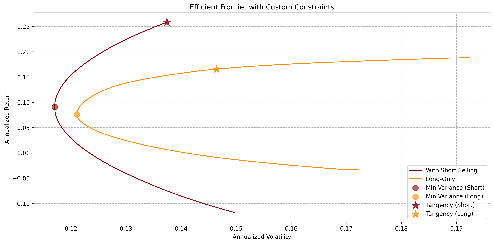
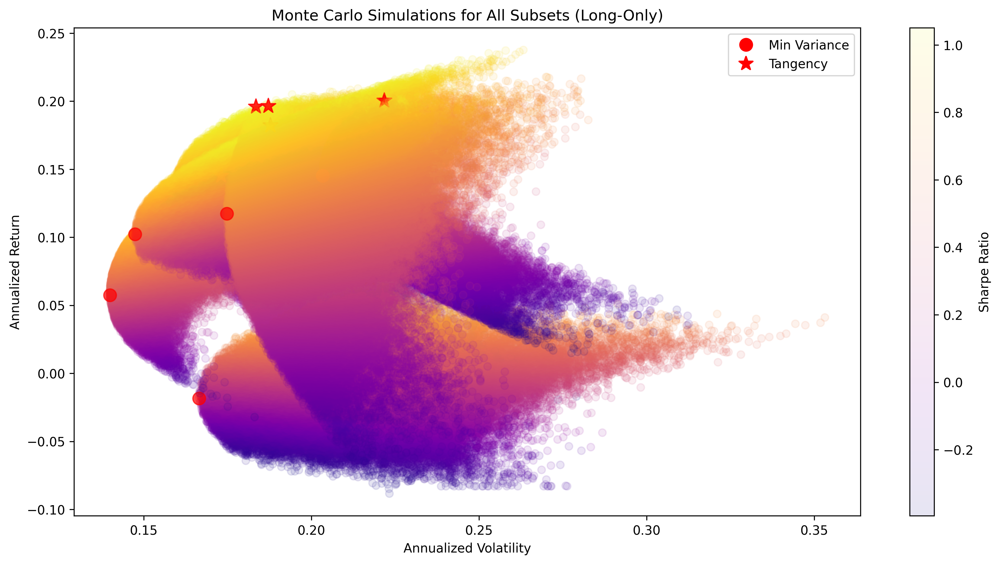
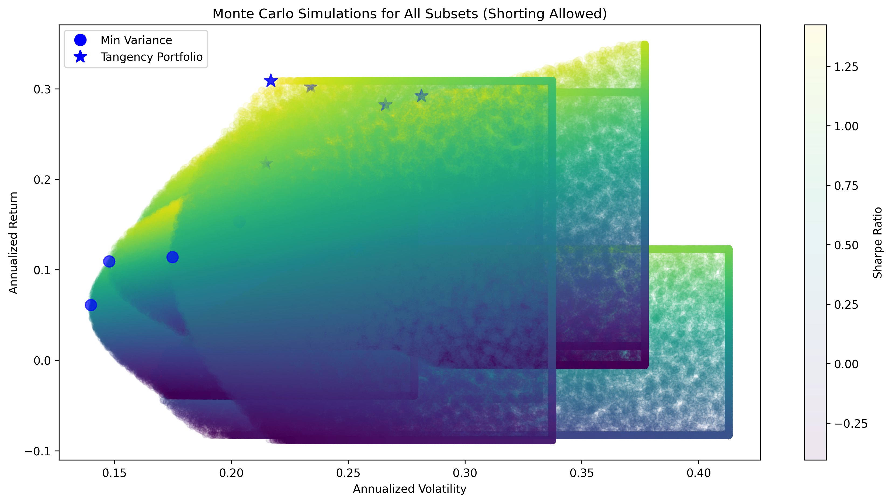

# Portfolio Optimization

This repository contains a portfolio optimization project completed during my Master's in Quantitative Finance at USI Lugano. The project centers around **numerical methods** for solving real-world portfolio selection problems using historical DJIA data.

Both **constrained optimization** (via SLSQP) and **Monte Carlo simulation** techniques are used to construct and analyze optimal portfolios, with a focus on understanding the effects of constraints, short selling, and diversification.

---

## Overview

The notebook is structured around four core components:

- **Summary Statistics & Volatility Modeling**  
  Daily log returns of DJIA constituents are analyzed. Annualized return and risk metrics are calculated, and a GARCH(1,1) model is applied to the DJIA index to capture conditional volatility.

- **Efficient Frontier via Constrained Optimization**  
  The efficient frontier is computed numerically using SLSQP, both with and without short-selling. A second version includes **custom constraints** (e.g., minimum/maximum weight per asset, limited short exposure) to reflect practical investment policies.

- **Monte Carlo Experiment 1**  
  A large number of portfolios are randomly generated using Dirichlet and truncated normal distributions. This experiment approximates the efficient frontier and compares it to constrained optimization results.

- **Monte Carlo Experiment 2**  
  Multiple random subsets of 5 stocks each are analyzed to show how diversification (or lack thereof) impacts risk–return characteristics under both long-only and short-selling conditions.

---

## Files

- **`portfolio_optimization.ipynb`** The main notebook containing the full workflow: data acquisition, numerical optimization, Monte Carlo simulations, and all plots/tables.

- **`plots/`** Folder containing selected output figures from the analysis.

---

## Results Example

Below are selected visual outputs showcasing key findings from the analysis:

- **Annualized Correlation Matrix of DJIA Stocks**  
  Visualizes how strongly stocks co-move based on log returns.

  

- **Efficient Frontier with and without Short-Selling**  
  Computed using SLSQP without custom bounds.

  

- **Efficient Frontier with Custom Constraints**  
  Reflects real-world bounds on asset weights. Indicates that practical constraints do not greatly reduce efficiency.

  

- **Monte Carlo Experiment 1: Full Universe Simulation**  
  Demonstrates how simulated portfolios approximate the efficient frontier using random weight generation.

  

- **Monte Carlo Experiment 2: Long-Only Portfolios from Random Subsets**  
  Illustrates performance variability and volatility across 6 random 5-stock portfolios under long-only constraints.

  

- **Monte Carlo Experiment 2: Portfolios with Short Selling from Random Subsets**  
  Same 6 subsets as above, but allowing short positions, showing increased frontier flexibility.

  

---

## User Guide

1. **Setup**  
   - Clone the repository:
     ```bash
     git clone https://github.com/Alessandro-Dodon/portfolio_optimization.git
     cd portfolio_optimization
     ```
   - Or download the ZIP and extract locally.

2. **Execution**  
   - Open `portfolio_optimization.ipynb` in Jupyter Lab, VS Code, or Anaconda.  
   - Run all cells to reproduce the analysis.  
   - An internet connection is required to fetch financial data from Yahoo Finance.

3. **Dependencies**  
   - All necessary libraries are listed in the notebook header.  
   - Use `pip install` for any missing packages (e.g., `yfinance`, `arch`, `scipy`, `seaborn`).

---

## Contact

For questions or feedback, feel free to email me at **alessandro.dodon@usi.ch**.  
You can also connect via [LinkedIn](https://github.com/Alessandro-Dodon) through my GitHub profile.
